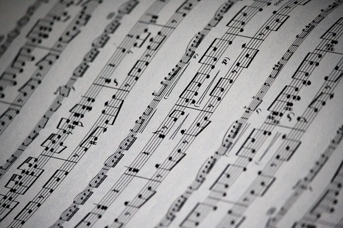

# Quizzy Rascal

## Author
Emma Lawlor

## Project Overview
Quizzy Rascal is an interactive music trivia quiz. Desgined to provide entertainment to the user, the quiz asks 10 random music questions.The quiz is presented in a multiple choice format, displaying the correct/incorrect answers on submission and keeping track of user's score at the bottom of the window. 

The name was chosen as a play on the stage name of English rapper Dizzee Rascal, helping to set a fun and lighthearted tone. 

## Deployed Site
https://emmalawlor.github.io/quizzy-rascal/

## Table of Contents

## UX

### Project Goals
#### As the Site Owner I Want to:
- Present a fun, interactive music quiz to the user.
- Provide the user with instructions/rules for playing the quiz.
- Give feedback to user when answer is selected, displaying both correct and incorrect options. 
- Display user's current score throughout the running of the quiz.

#### As the Site User I Want to:
- Play a fun and easy to use quiz to test music knowledge.
- Progress easily and intuitively through the quiz, with the option of returning to the homescreen at any point.
- Be informed whether chosen answer was correct or incorrect when selected.
- Be aware of current score while progressing through the quiz. 

### Design Choices

- Typography
    - The 'Nova Round' font from [Google Fonts](https://fonts.google.com/specimen/Nova+Round) was used throughout the site.
    
    
    
    - A fallback font of cursive was used in case of any broswer compatability issues with chosen fonts.

- Images

    - [Background Image](https://github.com/EmmaLawlor/quizzy-rascal/blob/main/assets/images/music-notes.jpg0) of black and white music notes chosen as it is in keeping with the musical theme of the quiz. The same image was used across all page of the site to maintain a sense of familiarity and to keep the overall layout simple and content-focused. 

- Colors 

    - Vibrant yellow(#ffff00) 
 and blue(#0000ff) 
 colors were chosen for the site to maintain the fun feel of the site. 
    - As seen in the wireframes, the Quizzy Rascal heading and sub-heading were originally intended to be blue. 
    - The [WebAIM](https://webaim.org/resources/contrastchecker/) site was used to check the contrast of both colours against a background of black, the predominant color of the background image. 
    - The blue(#0000ff) color failed the contrast check in terms of accessibility.
    

    - The yellow(#ffff00) color passed the contrast check, and so the heading and sub-heading were changed to this font color to improve visual accessibility. 
    
    
    - Color codes were take from [htmlcolorcodes.com](https://htmlcolorcodes.com/)

- Transitions/Animations
    - A fade in/out effect was applied to the quiz-area of the Quiz page to enhance user experience and visual appearance. 
    - When the user selects and answer to the displayed question, the answer button first turns red or green depending on whether the answer was correct/incorrect.
    - The entire quiz container then fades out and fades back in, displaing a new question to the user. 

### Wireframes
- The wireframes for this project were created using (Balsamiq)[https://balsamiq.com/]
- The Home, Quiz and Results pages were drawn up in mobile, desktop and tablet views. 
- The wireframes helped to map out the basic structure of the site while building the project, however some style and layout changes were made throughout the development process. 
    - Desktop View: Home, Quiz and Result Pages
    
    

    - Mobile View: Home, Quiz and Result Pages
    
    

    - Tablet View: Home, Quiz and Result Pages
    
    

### Implemented Features
- Heading & Sub-heading: prominently positioned in the top center pf the window on both the home page and result page. The inculsion of these give the user a very clear indictaion of what the site is about. 
-

- Play Button: Located in the center of the home page, this take the user straight to the start of their quiz game makiing the site very easy to navigate.

- Rules Modal: Again located in the center of the home page, the rules button activates a modal which simplpy describes how to play the quiz and how scoring works. This makes the quiz quite simple for any user to play. The modal also features a play button which takes the user directly to the start of the quiz.

- Home Link: Featured in the top-left corner of the Quiz page, this hoouse icon acts a direct link back to the Home page making site navigation simple for the user. 

- Audio Control: Located in the top-center of the Quiz page, this allows the user to control the background usic which available while playing the quiz. The background music can easily be toggled on/off with a simple click of the volume icon. 

- Score Tracker: Located in the top-right of the quiz page, this keeps track of and prominently displays the user's score throuhgout the quiz. It increments by 1 point each time a question is answered correctly. 

- Quiz Area: Main play area of the quiz page. Question is displayed along with 4 multiple choice answer buttons. User selects their answer by clicking an answer button, which turns green if answer is correct or red if answer is incorrect. The quiz then displays the next set of question/answers after a short delay, up to a maximum of 10 questions.

- Result Box: Displayed at the end of the 10 quiz questions, this shows the user their final score for the round. The result box also contains a 'play again' button which takes the user back to the quiz page to start another round of 10 questions, encouraging the user to continue playing the quiz. 

### Future Features to Implement
- Score Board
    - This would allow the user to add their name and score to a leaderboard on the site. 
    - This could keep a record of the top 5 or 10 users and their scores. 

- Extend quiz options
    - Create a number of music trivia categories based on music genres or decades of music.
    - Add the option of selecting difficulty so user could answer easy or difficukt questions, depending on their music knowledge.

- Enhance CSS
    - Use CSS to help display the focused button on the quiz more clearly when tabbing through the page via keyboard. 
    - At present the default blue highlight blends with the style of the buttons on the page. 
    
## Testing

### Validation Testing

#### HTML
All html pages of this site were validated using [W3C validator](https://validator.w3.org/)

- The Home page (index.html) returned the following errors

    - This was rectified by removing the button element from both of the links in question, as seen here:
    

    - The links were then styled to resemble buttons using CSS, as shown here:

    

    - After making these adjustments, the Home page passed through the validator without and errors or warnings.
    

- The quiz page passed through the validator with no errors or warnings.

- The result page retured the following error:

    - As above, on the home page, this was corrected by removing the button element from the play link.
    
    
    - The link was then styled to resemle a button, in keeping with the rest of the site:
    
    

    - The quiz page then passed through the validator with no further errors or warnings:
    

#### CSS
- The CSS file for this was validated using the [W3C Validator](https://jigsaw.w3.org/css-validator/)
- When passed through the validator, the CSS file returned no errors or warnings

#### JavaScript
All JavaScript files for this site were validated using [JSHint](https://jshint.com/)
- The script for the Rules modal returned no errors or warnings

- The file for the quiz page returned the following

    - The first issue regarding displayUserResult is due to the file structure of the site. This function is defined in annother file and used here, which is not take into account by JSHint.
    - Of the 5 unused variables detected, 3 were deleted from the file (quizBox, answerBtn and result) as they were not used in the project. 
    - The variables checkAnswer and musicControl flagged as undefined as these are called from the html page using onclick fucntion. 

- The JavaScript file for the Result page returned no errors or warnings 

### Manual Testing
Manual testing of all features of the site were carried out on a number of devices and browsers, as detailed in [this document](https://1drv.ms/b/s!AtrJulJDGsm2pgfk5eR_CTdHovEF)

*Preview*

### Cross Browser and Device Testing
The site was tested across a number of devices and browsers to ensure all elements function correctly and appear as expected. The browsers and devices tested are as follows:

| TOOL / Device                   | BROWSER     | OS         | SCREEN WIDTH  |
|-------------------------------  |-------------|------------|---------------|
| real phone: iPhone8             | safari      | iOs        | XS 375 x 667  |
| real phone: iPhone11            | safari      | iOs        | XS 414 x 896  |
| real phone: samsung galaxy s10  | chrome      | android    | XS 360 x 740  |
| real tablet: ipad Air 2         | safari      | iOs        | M 768 x 1024  |
| real computer: avita laptop     | chrome      | windows 10 | XL 1366 x 768 |
| real computer: avita laptop     | firefox     | windows 10 | XL 1366 x 768 |
| real computer: dell desktop     | chrome      | windows 10 | XL 1920 x 1080|
| dev tools emulator: iPhone5s    | safari      | iOs        | XS 320 x 568  |
| dev tools emulator: ipad pro    | safari      | iOs        | L 1024 x 1366 |
| dev tools emulator: MS lumia550 | edge        | windows    | XS 360 x 640  |

### Defects

#### Defects of Note
- Any defects which occurred during development were tracked using the GitHub Issues section of this repository, which can be found [here](https://github.com/EmmaLawlor/quizzy-rascal/issues).
- Details of each bug were noted as they were discovered, with screenshots taken to demonstrate the problem where possible. 
- The GitHub Issues section allowed for close out of defects as they were rectified, again using screenshots to show the solution when possible. 

#### Outstanding Defects
- No outstanding defects have been noted. 

### Spelling and Grammar
- The text content of the site was checked for spelling and grammar errors using [Grammarly](https://www.grammarly.com/)

## Accessibility

### Keyboard Navigation
- Keyboard navigation could be improved by highlighting the button outline better. 
- This was not implemented on the site so as not to deviate from the style of the site. 
- Future development could focus on improving the button highlight using CSS

## Deployment

The site was deployed from its [GitHub Repository](https://github.com/EmmaLawlor/quizzy-rascal) to GitHub Pages using the following steps: 

1. From the Quizzy Rascal repository, select the Settings tab.

2. Select the Pages sub-menu on the left of the page.

3. Under Source, select the main branch and hit save.

4. Upon saving, the page refreshes to confirm deployment of site and provides link to [live site](https://emmalawlor.github.io/quizzy-rascal/)

## Credits

### Media
- [Background Image](https://github.com/EmmaLawlor/quizzy-rascal/blob/main/assets/images/music-notes.jpg) of black and white music notes, used on all pages taken from [pxhere.com](https://pxhere.com/en/photo/1043482)

- Background music is track "Online Deal", taken from [playonloop](https://www.playonloop.com/freebies-download/)

- House icon for home page link and audio control icons used in quiz pager header all taken from [Font Awesome](https://fontawesome.com/)

- Screenshot of live site for this write-up created using [AmIResponsive](http://ami.responsivedesign.is/)

### Content
- Trivia content for quiz questions take from [Radio Times](https://www.radiotimes.com/quizzes/pub-quiz-music-round/) and [Thought Catalog](https://thoughtcatalog.com/samantha-newman/2020/04/music-trivia-questions/)

### Acknowledgements
- Favicon created using [favicon.io](https://favicon.io/favicon-converter/)
- Nova Round font imported from [Google Fonts](https://fonts.google.com/specimen/Nova+Round?query=round#glyphs)
- Help sought from W3Schools in creating modal to contain quiz rules. Code adapted and modified from [here](https://www.w3schools.com/howto/howto_css_modals.asp)
- Help in applying click transform effect to buttons from [Geeks for Geeks](https://www.geeksforgeeks.org/how-to-add-a-pressed-effect-on-button-click-in-css/)
- Code for incrementing user score was adapted from the Code Institute Love Maths walkthrough project
- Help in centering the modal on the screen was sought from [Stack Overflow](https://stackoverflow.com/questions/39627549/how-to-center-modal-to-the-center-of-screen/39636961)
- Help in fixing size of background image from [css-tricks.com](https://css-tricks.com/perfect-full-page-background-image/)
- Help with fade transition on Quiz page was from [css-tricks.com](https://css-tricks.com/almanac/properties/t/transition/)
- Much help in constructing the basic quiz and JavaScript functions was got from [this tutorial](https://youtu.be/f4fB9Xg2JEY) by [Brian Design](https://www.youtube.com/channel/UCsKsymTY_4BYR-wytLjex7A)

### Thank You
- Thanks to Code Institute cohort facilitator Kasia for providing advice and learning resources as well as a listening ear, whenever needed. 
- Thank you to the Code Institute tutors who provided such helpful feedback when needed. 
- A huge thank you to my mentor Malia Havlicek for her wisdom, advice and invaluable experience when providing support throughout project development. 
